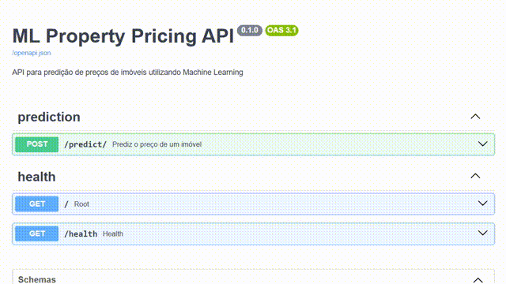

# Property Pricing API with MLOps

[Clique aqui para a versão em português deste README](README.md)

---

<p align="center">
  
  
  
  
  
  
  
</p>

---

## 📌 Project Overview

This project delivers an end-to-end Machine Learning service that predicts property prices. More than a single model, it showcases a production-grade ML product that follows MLOps best practices, solid software engineering, and full automation.



## ✨ Key Features

- 🤖 **Automated Training Pipeline**: Trains, evaluates, and versions a regression model with Scikit-learn.
- 🔍 **MLflow Experiment Tracking**: Logs experiments, parameters, metrics, and artifacts to guarantee reproducibility.
- 🚀 **High-Performance Inference API**: Serves the model through an asynchronous RESTful API built with FastAPI.
- 🐳 **Containerized Environment**: Docker ensures reliable execution across any environment.
- ✅ **Code Quality Assurance**: Automated tests with Pytest and linting with Ruff.
- 🔄 **Automated CI/CD**: GitHub Actions workflow validates the codebase on every push, preserving code integrity.

## 🧠 Solution Architecture

The workflow starts with the training script (`scripts/train.py`), which processes the California Housing dataset and registers the trained model in MLflow. The FastAPI service (`app/`) fetches the latest model tagged with the `staging` alias and exposes a `/predict` endpoint for real-time inference. The entire system is packaged in a Docker image to ensure portability and ease of deployment.

## 🛠️ Technology Stack

- **Backend**
  - FastAPI, Uvicorn
- **Machine Learning**
  - Scikit-learn, Pandas, NumPy
- **MLOps**
  - MLflow (experiments, model registry)
  - Poetry (dependency management)
- **Infrastructure & DevOps**
  - Docker, GitHub Actions
- **Quality & Observability**
  - Pytest, Ruff, Structured logging

## 🧪 Running Locally

1. **Clone the repository**
   ```bash
   git clone https://github.com/<your-username>/ml-property-pricing-api.git
   cd ml-property-pricing-api
   ```
2. **Install Poetry**
   ```bash
   curl -sSL https://install.python-poetry.org | python3 -
   ```
3. **Install dependencies**
   ```bash
   poetry install
   ```
4. **Start the MLflow server**
   ```bash
   poetry run mlflow ui
   ```
5. **Run the training pipeline**
   ```bash
   poetry run python scripts/train.py
   ```
6. **Promote the model to the `staging` alias**
   - Open the MLflow UI (default at `http://127.0.0.1:5000`)
   - Locate the trained model and assign the `staging` alias
7. **Launch the FastAPI service**
   ```bash
   poetry run uvicorn app.main:app --reload
   ```
8. **Explore the interactive documentation**
   - Visit `http://127.0.0.1:8000/docs` in your browser

## 🧬 Running Tests

```bash
poetry run pytest
```

